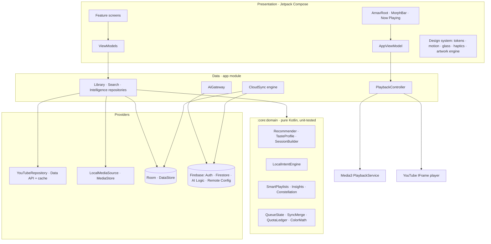

<div align="center">

# Arnav Music — Background edition
**Music, alive.**

This independent copy adds experimental YouTube background playback, a media notification, lock-screen/headset controls and artwork in Song mode. Video mode displays the video. [Download the latest APK](https://github.com/Arnav-Dugad/Arnav-Music-Background/releases/latest).

Hidden/background IFrame playback is contrary to YouTube API policies. This edition is not policy-compliant, and YouTube or Android/WebView changes can break it. No stream extraction, downloading or ad blocking is added. See [background edition setup and validation](docs/BACKGROUND_PLAYBACK.md).

A premium, local-first Android music experience: YouTube discovery through official APIs, your own on-device library with full background playback, and an on-device intelligence layer called **Arnav AI**.


[**Download the latest APK →**](../../releases/latest)

</div>

---

## Contents
1. [What it is](#what-it-is)
2. [Screenshots](#screenshots)
3. [Features](#features)
4. [Zero-cost guarantee & limits](#zero-cost-guarantee--limits)
5. [Architecture](#architecture)
6. [Tech stack](#tech-stack)
7. [Getting started](#getting-started)
8. [Build & release](#build--release)
9. [Privacy](#privacy)
10. [YouTube policy compliance](#youtube-policy-compliance)
11. [Known limitations](#known-limitations)
12. [Roadmap](#roadmap)
13. [License & attribution](#license--attribution)

## What it is
Arnav Music is an **independent** app that combines:

| Source | How it plays | Background playback |
|---|---|---|
| **YouTube** (search, trending, playlists) | Official embedded **YouTube IFrame player**, always visible, ads and attribution intact | Experimental — service-owned IFrame with a media notification; contrary to YouTube API policies. |
| **Your device** (MP3, FLAC, M4A, OGG, WAV… via MediaStore) | Native **Media3/ExoPlayer** | Yes — notification, lock screen, Bluetooth, headset, gapless |

Everything around playback — library, history, recommendations, Taste DNA, Moments, Arnav AI — works the same for both, because the UI only talks to a source-agnostic `PlaybackController` and reads `PlaybackCapabilities`.

## Screenshots
> Placeholders — add device captures here.

| Home | Now Playing | Arnav AI | Taste DNA |
|---|---|---|---|
| _home.png_ | _player.png_ | _ai.png_ | _dna.png_ |

## Features

**Signature experiences**
- **MorphBar → Now Playing**: one continuous spatial transformation. The artwork (or the visible YouTube player) physically travels from the mini bar to the hero position; drag up/down to scrub the transition, fling to settle.
- **Dynamic artwork environment**: a deterministic, contrast-guaranteed palette (unit-tested: ≥7:1 text, ≥4.5:1 muted, ≥3:1 accent on every backdrop) tints the player, accent, glass and charts.
- **Living Artwork**: slow light drift, soft orbs and optional gyroscope parallax; fully disabled by Reduce Motion, battery saver or heat.
- **Glass mode**: four optical layers (Thin, Regular, Thick, Elevated) with individual opacity, tint, edge light and elevation; Pure mode is fully opaque and equally polished. Real backdrop blur on Android 12+ where the performance budget allows.
- **Arnav AI sessions**: “45 minutes of energetic coding music, mostly familiar, a few surprises” → structured constraints → real, playable songs → deterministic ordering along an energy curve, with an energy chart and per-track explanations.
- **Moments**: ten immersive procedural environments (Night Drive, Rain, Deep Focus, Golden Hour, Gym…) with their own motion and typography — no images or AI image generation.
- **Taste DNA**: listening clock, week rhythm, discovery/repeat/skip gauges, artist affinity, music age, recent shifts, recaps (day/week/month/year), with stated confidence.
- **Taste Constellation**: your artists as stars, co-listening as light threads; pan, pinch, tap.
- **Listening Timeline & Time Machine**: “Take me back to this day”, “You loved these three months ago”, “Your January era” — only claims the data supports.
- **Queue**: drag-to-reorder with floating lift and neighbour displacement, swipe actions, a **Journey** timeline with ETAs, save queue as playlist.
- **Command palette** (Ctrl/⌘+K on keyboards): commands, moments, settings, search and “Ask Arnav AI …”.
- **Song / Video switch** (like YouTube Music): every YouTube track has a Song | Video toggle in Now Playing. *Song* finds the label's official “Topic” art track; *Video* finds the music video. Both play in the visible official player, and the switch keeps your position.
- **Singles only**: recommendations, AI sessions and the *Songs* search filter drop mixes, mashups, jukeboxes, “1 hour” loops and anything over 13 minutes. Official “Topic” uploads rank first.
- **Unplayable-video rescue**: when an uploader blocks embedding, a card offers *Find another upload* (one cached search, Topic channels preferred), *Open in YouTube Music* or *Skip*, and can do it automatically (Settings → Playback).
- **Label credits**: titles like `Song | Film | Actor A, Actor B | Composer` become title, album (the film) and credits.
- **Artwork flight**: tap a Home card and its cover flies into the player.
- **Now Playing details**: a soft halo in the cover's colour that swells on the beat, an *Up next* chip (tap for the queue) and a media volume slider that follows the hardware buttons, shown on screens tall enough for them. Cover-art YouTube uploads appear as a square cover instead of a letterboxed video (Settings → Crop cover-art videos).
- **Living Now Playing**: for songs on your phone the background slowly drifts through the cover's colours (GPU shader on Android 13+). Swipe up and the queue follows your finger as one continuous motion while Now Playing recedes behind it. Double-tap the left or right of the cover to skip back or forward 5 seconds; keep tapping to add more. Long-press a queue row and it lifts, its neighbours spring aside and it snaps magnetically into the nearest slot. On a song change the old cover dissolves into particles while the new one assembles.
- **Cover carousel**: swipe the Now Playing cover left/right to move through the queue, with the neighbours peeking in.
- **Liquid glass** (Android 13+): an AGSL lens shader bends and refracts the artwork behind the mini player and glass previews.
- **Circular theme reveal**: switching theme or glass mode expands the new look from your finger.
- **Home-screen widget**: artwork, title and play/skip, plus *Ask Arnav AI* and *Moments* shortcuts. It resizes with its cell size.
- **Import from YouTube**: Library → ☁︎ copies your YouTube playlists and *Liked videos* into Arnav playlists, with live progress. It uses read-only access, and the token never leaves memory.
- **Lyrics, Apple Music style**: big time-synced lines that glide into place with a gentle cascade, word-by-word fill (from enhanced LRC, or estimated from syllables for line-timed and auto-timed lyrics), backing vocals shown smaller and offset under the lead line (from `[bg:]` lines or parenthesised echoes), breathing dots through instrumental breaks, tap a line to jump there. The cover tucks into the corner while lyrics are open. **Auto-timing**: plain (untimed) lyrics are timed to the song automatically. On-device songs use a vocal-activity curve from on-device analysis, so stanzas line up with the singing and repeated choruses keep their timing; YouTube songs get an estimate. *Adjust timing* lets you tap along to fix any line (±0.5 s nudges) and saves the result as synced lyrics. **Arnav AI lyrics**: songs with no lyrics anywhere can have them written by Gemini from the song's audio (or its public YouTube link). It runs automatically for the song that's playing (Settings → AI lyrics when none exist, max 15 a day) or from the *Generate with Arnav AI* button, and the result is labelled as AI-written. Sources: lyrics embedded in your own files (ID3 USLT/SYLT, FLAC, MP4), `.lrc`/`.txt` files you import, text you paste, and **LRCLIB**. LRCLIB is an open, community-maintained lyrics database; synced lyrics are fetched once and saved on the device (Settings → Playback → Online lyrics).
- **Tabs always take you home**: tapping a tab always lands on its main page, clearing sub-pages, collapsing the player and closing sheets. Tapping the current tab again scrolls to the top.
- **Plain search on Home**: the Home bar is a normal song/artist/playlist search; Arnav AI lives in its own tab.
- **Floating player (picture-in-picture)**: leave the app mid-song and the player shrinks into a window with play/pause/skip. YouTube keeps playing only while that window is visible.
- **Studio layout for tablets**: navigation rail, your library, and a docked Now Playing + Up Next pane side by side.
- **Artwork that travels**: playlist and mix covers grow into their page's hero (shared-element transitions), and Home cards fly into the player.
- **Ambient edge glow (OLED)**: an idle Now Playing screen sinks to black, with a hairline of progress light running around the screen's rounded edge. It also works over lyrics and full-screen lyrics, dimming only gently so the words stay readable.
- **Motion details**: depth-swap track changes (the old cover sinks and blurs, the new one rises), a play/pause glyph that morphs between shapes, a heart that fills from its centre, a springy bounce at the ends of the queue, predictive-back previews, and haptic ticks while scrubbing.
- **Beat-synced light**: songs on your phone are analyzed on device for tempo, loudness and energy. The Now Playing light then breathes with the beat (capped well below flashing rates), and energy-aware features use real measurements instead of estimates. Optional **beat-drop haptics** (off by default) give one pulse at each detected drop.
- **Streaks & milestones** in Insights: current and longest listening streak, plus milestones like your first 1,000 minutes or 100 artists. There are no reminders or nags.
- **Import from Spotify or CSV**: pick your Spotify data export (`.zip`/`.json`) or any CSV. Songs are matched against music on your phone first, then against YouTube. Official "Topic" uploads are preferred, and matching stays under the free daily quota.
- **YouTube playlist re-sync**: refresh imported YouTube playlists on demand. They also refresh quietly once a day when Google already allows it.
- **Widgets & system**: Now Playing, Up Next (queue) and Your Week widgets, all lock-screen capable where Android supports it. Also a Quick Settings tile, a Like button in the media notification/lock screen, and a themed (monochrome) icon.
- **Lyrics, deeper**: full-screen lyrics over the cover blurred across the whole screen; the line being sung appears under the title in the mini player; on analyzed songs from your phone the sung line swells very slightly with the song's loudness.
- **Long-press to preview**: hold any cover to hear about 15 s from a third of the way in (YouTube in its own visible player). Whatever was playing pauses and resumes afterwards.
- **Tactile covers**: cards tilt toward your finger while pressed. Swipe down on the Now Playing cover to close the player, and a new song's cover spirals out from the play button.
- **Colour that follows the music**: each playlist page takes its accent from its cover, and the tab bar picks up the artwork's colour while music plays.
- **Key detection & Harmonic mix**: songs on your phone get their musical key (with Camelot code). *Harmonic mix* in Up Next reorders songs so keys, tempos and energy flow, and the queue glides into the new order. Shuffle animates the same way.
- **Smart transitions**: analyzed songs fade out where their outro begins and the next song skips silence at its start (soft intros are kept).
- **Listening calendar**: a GitHub-style heatmap of the last year in Insights. Tap a day to see its minutes.
- **Play counts & first-played dates** in every song's menu.
- **Duplicate finder**: the same song across imports, your phone and YouTube, with "Keep this version" to tidy every playlist at once.
- **Import history**: undo or redo any Spotify, CSV or YouTube import.
- **Lyrics widget**, **Android Auto** (songs on your phone, with browse, voice search and chapter buttons), **home-screen shortcuts** for any playlist (plus the 4 most recent as launcher shortcuts), and **chapters** for long tracks (from the file or the YouTube description).
- **A real recommender, on your phone**: it learns from every play (finished, skipped early or late, replayed), likes, your own and imported playlists, searches, the time of day and day of week, which songs follow which in your sessions, and the sound of songs on your phone (tempo, key, energy). It combines played-together statistics, a song–artist–genre graph, a small taste embedding and sound similarity. The blend tunes itself to what you finish or skip, keeps artists varied, and explains every pick ("Often follows Kesariya in your sessions"). Home gets **For you right now**, **Daily mixes**, **Fresh finds** and **Rediscover**. Every song has **Start radio**, **More like this**, **Not interested** and **Don't recommend this artist**, and **endless radio** keeps the music going when the queue ends.
- **Top songs this month**: a smart playlist that rebuilds itself every calendar month.
- **Lyrics translation & romanisation**: an on-device translation (ML Kit) and Latin-letter romanisation under each line. The sung line also bounces lightly on the beat for analyzed songs.
- **Sing mode**: lowers the vocals of songs on your phone, live, while bass and stereo-panned instruments stay. Tap the mic in Now Playing; long-press for the level.
- **Download lyrics for a playlist**: fetches LRCLIB lyrics for every song in one go, for offline use.
- **Credits**: writers, producers, engineers, label, ℗/© and ISRC, read from your files' tags or YouTube "Topic" descriptions.
- **Albums**: an Albums tab and album pages with Disc 1/Disc 2 sections and track numbers, for music on your phone.
- **Missing info fixed automatically**: unknown artists, albums and covers for songs on your phone are filled in from MusicBrainz and Cover Art Archive on Wi-Fi (your files are never modified). You can also edit any song's info by hand.
- **Artist history**: each artist page shows your plays, listening time, first and last listen, a 12-month chart, your top songs and when you play them most.
- **Premium motion**: playlist headers collapse with a parallax cover, and pressing Play flies the cover into Now Playing as its colours take over the page. The whole theme crossfades between songs. The cover breathes while playing and settles back when paused. Songs on your phone get a waveform progress bar drawn from their measured loudness, and the back gesture follows the Android 15 style. Artist → album → Now Playing is one chain of shared-element morphs: album covers grow into the album page, artist avatars into the artist header, and Play flies the cover into the player.
- **Listening stats** (Taste DNA → Listening stats): a 24-hour genre clock, a weekly discovery score (how much of your listening was new), songs you keep skipping at the same second (with *Trim it here* for on-device songs), and **Export CSV** of your history through the file picker. Everything is computed on the device.
- **Material You widgets** that follow your wallpaper colours (or keep the dark glass look).
- **Clean YouTube player**: YouTube's controls are hidden (via its official option) and replaced by Arnav Music's own. In Song mode, what's on screen is just the album art.
- **Tested on an emulator**: every push runs a suite of end-to-end UI tests on an Android 14 emulator in GitHub Actions. It covers onboarding, navigation regressions, search, every settings page, local playback with lyrics, rotation and a seeded random-tap smoke test.

**Everything else**
- Home composed from ≤8 prioritised sections (time-of-day aware); never an empty first launch.
- Explore: moments, trending (1-unit chart call), genres; search with instant local matches, 650 ms debounce, filters, grouped results, saved results, paging, skeletons and intentional error states.
- Library: liked, playlists (Arnav / YouTube / smart, clearly labelled), artists, on-device, history; list/grid/compact; sort; filter; pinning.
- Smart playlists (on device): Heavy Rotation, Forgotten Favorites, Recently Discovered, Most Replayed, Night Owl, Sunday Morning, Never Finished, Fresh Finds, Rediscover.
- Player: seek, shuffle (upcoming only), repeat, sleep timer (5–60 min, end of track, end of queue), output switcher, share cards rendered on device, lyrics only from licensed sources (none scraped).
- Local audio: gapless, fade in/out, skip silence, speed, pause on disconnect, system equalizer.
- Settings: account, appearance, playback, Arnav AI, sources, library, data & sync, notifications, privacy centre, usage & quotas dashboard, accessibility, performance, about/licences, developer panel (debug builds only).
- Adaptive layout: bottom bar on phones, navigation rail and two-pane player on tablets/foldables/landscape.
- Accessibility: TalkBack labels, custom accessibility actions mirroring every gesture, 48 dp targets, font scaling, high contrast, reduced transparency, three motion levels, haptics toggle.
- Deep links: `arnavmusic://track/<videoId>`, `playlist/<id>`, `artist/<name>`, `ai?q=…`, `search?q=…`, `settings/<page>`, `moment/<id>`, plus shared YouTube links.

## Zero-cost guarantee & limits

Arnav Music never requires a credit card, a paid plan or a paid API. It never enables billing on its own.

| Capability | Runs on | What happens when the free limit is reached |
|---|---|---|
| Playback of on-device music | **Device only** | Nothing — no limits |
| Library, likes, playlists, history, queue, settings | **Device (Room/DataStore)** | Nothing — no limits |
| Recommendations, smart playlists, Taste DNA, recaps, constellation, Time Machine | **Device only** (pure Kotlin `:core:domain`) | Nothing — no limits |
| Arnav AI fallback engine (moods, durations, negation, energy curves) | **Device only** | Nothing — always available |
| YouTube search, trending, playlists, metadata | **YouTube Data API v3** with *your* key (default 10,000 units/day) | Searches are cached and reused; near the limit the app conserves (week-old cache counts as fresh); at the limit it serves saved results and explains why. Resets daily. |
| YouTube playback | Official embedded player | Not quota-metered |
| Arnav AI natural-language interpretation | **Gemini Developer API free tier** via Firebase AI Logic | Local per-day cap (default 40, configurable), 4 s throttle, 7-day answer cache. On quota/error the on-device engine answers — sessions still build. |
| Account (Google / email) | **Firebase Auth (Spark)** | Spark limits are far above personal use |
| Cloud sync of likes & playlists | **Cloud Firestore free quota** (50k reads / 20k writes / day) | Writes are dirty-flagged, debounced (4 s) and batched; pulls are incremental (`updatedAt >` last pull). Typical use: tens of operations/day. If exceeded, sync pauses; everything keeps working locally. |
| Remote Config, Analytics (opt-in), App Check | Firebase Spark | Free |

**Things that could require billing in the future (not used):** Cloud Functions, Firebase Storage on Blaze, Crashlytics/Performance Monitoring (left out to avoid build-time plugins and any billing ambiguity), paid Gemini tiers, licensed lyrics providers. None are wired in.

Releases are built with the project's `app/google-services.json` (public client config — the same values ship inside every APK; data is protected by Firestore rules and App Check). Forks without a Firebase config build a fully functional **local-only edition** (no account, no cloud AI).

## Architecture



- **`:core:domain`** has no Android dependencies: models, provider contracts (`MusicCatalogProvider`, `SearchProvider`, `PlaybackProvider`, `LibraryProvider`), recommendation, intent parsing, session building, sync merge rules, queue operations, quota policy, colour correction, formatting. It's unit-tested in CI.
- **`:app`** contains data adapters, playback, DI (Koin), design system and features. Package layout: `core/{ai,common,db,diagnostics,firebase,local,notify,perf,playback,repo,security,settings,youtube}`, `ui/{theme,components,player,artwork,palette}`, `feature/{home,explore,library,collection,ai,moments,insights,profile,settings,auth,onboarding}`.
- **Why Koin instead of Hilt**: no annotation processing on top of Room's KSP, faster builds, and no Kotlin/KSP version coupling — the dependency graph is still one explicit, testable module (`di/AppModule.kt`).
- **Offline-first sync**: Room is the source of truth → optimistic local writes with `dirty` flags and tombstones → debounced batched Firestore writes → incremental pulls → last-write-wins merge where tombstones win ties (`SyncMerge`, unit-tested) → WorkManager retry with backoff.

More detail: [docs/ARCHITECTURE.md](docs/ARCHITECTURE.md).

## Tech stack
Kotlin 2.2 · Jetpack Compose (BOM 2025.08) + Material 3 as a foundation · Navigation Compose · Room 2.7 (KSP) · DataStore · Media3 1.7 · WorkManager · Koin 4.1 · Coil 3 · OkHttp · kotlinx.serialization · Firebase BOM 34 (Auth, Firestore, AI Logic, Remote Config, Analytics, App Check) · Credential Manager + Google ID · android-youtube-player (official IFrame API wrapper) · Manrope (OFL) · R8 + baseline profile.

## Getting started

### Just use it
Download the APK from [Releases](../../releases/latest) and install it (Android 8.0+). On-device music, library, intelligence and Arnav AI's on-device engine work immediately. To search YouTube, paste a free YouTube Data API key in **Settings → Sources** ([guide](docs/YOUTUBE_SETUP.md)).

### Build it yourself
Requirements: JDK 17+, Android Studio (Ladybug or newer) or the command line with the Android SDK (compileSdk 36).

```bash
git clone https://github.com/Arnav-Dugad/Arnav-Music-Background.git
cd Arnav-Music
./gradlew :core:domain:test :app:testDebugUnitTest   # unit tests
./gradlew :app:assembleDebug                         # debug APK
./gradlew :app:assembleRelease                       # R8-optimised release APK
```

Optional local secrets go in `local.properties` (never committed):

```properties
YOUTUBE_API_KEY=your-restricted-android-key
GOOGLE_WEB_CLIENT_ID=1234-abc.apps.googleusercontent.com
```

For cloud features, follow **[docs/FIREBASE_SETUP.md](docs/FIREBASE_SETUP.md)** and put `google-services.json` in `app/`. The build detects it automatically; without it you get the local-only edition.

## Build & release
Every push to `main` or `claude/**` runs **Build & Release** on GitHub Actions: unit tests → R8 release APK → lint → a GitHub Release (`v1.0.<run>`) with the APK and `SHA256SUMS.txt`. Commits containing `[no-release]` build without publishing.

Optional repository secrets (Settings → Secrets → Actions):

| Secret | Purpose |
|---|---|
| `GOOGLE_SERVICES_JSON` | Optional override for the committed `app/google-services.json` (e.g. a different Firebase project) |
| `YOUTUBE_API_KEY` | Built-in key (restrict it to the app's package + SHA-1!) |
| `GOOGLE_WEB_CLIENT_ID` | Web OAuth client id for Google sign-in |
| `ARNAV_KEYSTORE_BASE64`, `ARNAV_KEYSTORE_PASSWORD`, `ARNAV_KEY_ALIAS`, `ARNAV_KEY_PASSWORD` | Private release signing |

Without a private key, releases are signed with the **public community key** in `keystore/` so updates install over each other. It is intentionally public and must not be used for a Play Store listing.

## Privacy
- Listening history, searches, Taste DNA and on-device files **never leave the device**.
- Synced (only when signed in and sync is on): liked YouTube tracks and Arnav playlists, in your private Firestore space, protected by [strict rules](firebase/firestore.rules) with [emulator tests](firebase/tests/rules.test.mjs).
- Arnav AI sends the text you type, plus (if you allow) your top artist names and style hints. With *AI lyrics when none exist* on, it also sends the audio of an on-device song (or the public YouTube link) when it writes lyrics for that song.
- Analytics is **off by default**; when on, it records feature usage only — never titles, artists or search text.
- Settings → Privacy shows all of this and lets you clear search history, listening history, AI personalization, disconnect YouTube, delete the cloud profile, or delete the account.
- The user-supplied API key is encrypted with an Android Keystore AES-256-GCM key and excluded from backups. HTTPS only.

## YouTube policy status

This background edition uses the IFrame player with background playback enabled and hides the video behind artwork in Song mode. Those changes conflict with YouTube API policies. YouTube search and import continue using the existing API client. No stream extraction, downloads, client spoofing or ad blocking is added. Firebase configuration and security checks remain in place. Arnav Music is not affiliated with Google or YouTube.

## Known limitations
- Background playback depends on the embedded player and Android WebView. It has not been verified on every device; Android may end it after a force-stop or process kill.
- Play Integrity only vouches for installs from Google Play, so App Check can't verify an APK from GitHub, and Firebase requires App Check for AI Logic from 2 November 2026. For your own phone, turn on Settings → Arnav AI → *Verify with a debug token* and register the token in Firebase console → App Check → Apps → ⋮ → Manage debug tokens. Keep the token private.
- “Energy” and “style” hints for YouTube tracks are estimated from public titles/tags and are labelled as estimates.
- AI lyrics and auto-timing can be wrong. Gemini's copyright filter often refuses well-known commercial songs, and auto-timing without on-device analysis (YouTube) is an estimate. Use *Adjust timing* to fix it.
- Online lyrics come from LRCLIB's community database (not a licensed provider). Coverage is very good for popular songs but not complete, and timing quality varies by contributor.
- Google's At a Glance doesn't accept third-party content, so Arnav Music can't place a card there.
- Android Auto shows only songs on your phone (YouTube can't play there). Sideloaded builds need *Unknown sources* turned on in Android Auto's developer settings.
- Smart transitions fade between songs; they don't overlap two songs at once.
- No ReplayGain/loudness normalisation (not reliably supported by Media3 across devices); fades and skip-silence are provided instead.
- Baseline profile is hand-written; a generated profile (Macrobenchmark) is on the roadmap.
- YouTube Music's own *Liked music* list isn't exposed by the YouTube Data API. Import brings over *Liked videos* and your playlists instead.
- Importing playlists needs `youtube.readonly` on the OAuth consent screen. While the app is unverified, add yourself as a test user (see docs/YOUTUBE_SETUP.md).

## Roadmap
See the living list in the latest release notes and [docs/ROADMAP.md](docs/ROADMAP.md).

## License & attribution
Source code © Arnav Dugad. Third-party libraries are Apache 2.0; Manrope is under the SIL Open Font License 1.1 (`app/src/main/assets/licenses`). YouTube is a trademark of Google LLC.
